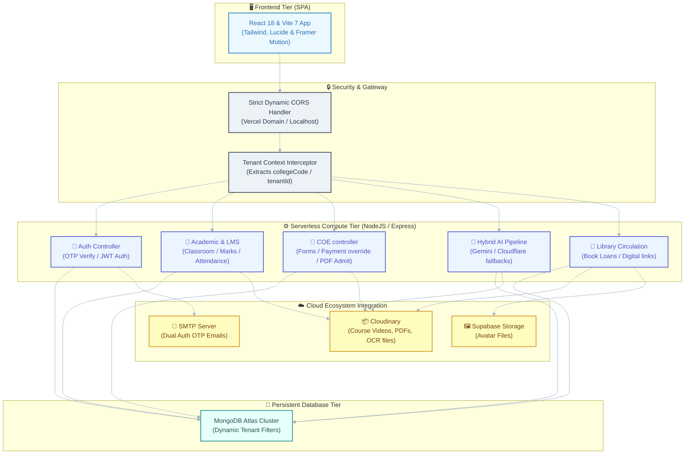

# 🎓 NoteLoom — Multi-Tenant College SaaS & AI Academic Portal

NoteLoom is a state-of-the-art, secure, multi-tenant Software-as-a-Service (SaaS) platform designed for higher education institutions. It unifies college administration, academic operations, student-faculty interaction, digital library resource circulation, a Controller of Examinations (COE) portal, and an advanced hybrid AI-powered study assistant pipeline.

---

## 🌟 Core System Features

### 1. Multi-Tenant Architecture & Secure Authentication
*   **Logical Tenant Isolation**: Multi-tenant isolation at the database layer using a tenant routing context interceptor. Database collections filter dynamically based on `tenantId` (College Code).
*   **Secure OTP Registration Gateway**: Multi-step registration secured via Gmail SMTP OTP verification.
*   **Dual Portal Configuration**: Standard portals for students, faculty, and college administrators, with an isolated system manager portal for SaaS IT administrators.

### 2. Academic Core Operations
*   **Hierarchy Configuration**: CRUD capabilities for Departments, Stream Codes, Subjects, and Batch calendars.
*   **Curriculum Structure Mapping**: Custom curriculum configurations support both semester and trimester systems.
*   **Dynamic Classroom Rosters**: Teachers can construct virtual classrooms, auto-enrolling students dynamically using roll ranges, ID sequences, or manual override enrollment.

### 3. Controller of Examinations (COE) Portal
*   **Exam Eligibility Check**: Students verify eligibility dynamically based on term structures and cycles.
*   **Form Submission & Fee Ledger**: Form application handling for regular and backlog courses, fully recorded in a centralized transaction fee ledger.
*   **QR-Coded Admit Cards**: Successful payments generate secure PDF admit cards embedded with unique QR codes for verification.
*   **Bulk Marks Entry & Publishing**: College administrators can upload scores in bulk and toggle result publishing states for student viewing.

### 4. LMS & Video Lecture Workspace
*   **Module Organization**: Lecture topics, documents, and videos grouped cleanly.
*   **Togglable Download Controls**: Faculty members can dynamically toggle download permissions on files, preventing unauthorized offline storage of course material.
*   **Cloudinary Video Streaming**: Streaming lecture videos with custom player controls.

### 5. Digital & Physical Library System
*   **Physical Circulation**: Tracks physical copy stock and handles 14-day checkout logs, automatic return audits, and fine computations.
*   **Digital Resource Vault**: Students and faculty can submit learning links, which undergo admin review and approval workflows before publishing.

### 6. Dynamic SaaS Feature Flags
*   **IT System Menu Configurations**: IT System administrators can toggle dashboard tabs and features globally or per role, tailoring the UI to the needs of each institution.

### 7. Hybrid AI Assistant Pipeline
*   **Socratic Tutor Mode**: Guides students step-by-step through academic questions without giving answers directly.
*   **Flowchart Mindmaps**: Dynamic generation of Mermaid.js flowcharts visualizing conceptual structures.
*   **Multimodal File Summary**: Text extraction from PDF, Word, Excel, PowerPoint, and images (OCR).
*   **Speech-to-Text Video Transcription**: Transcribes lecture videos using Whisper model fallbacks if direct video parsing limits are reached.

---

## 👥 Platform User Roles & Permissions

| Role | Description | Core Operations | Access Scopes |
| :--- | :--- | :--- | :--- |
| **Student** | Registered learner | Apply for exams, download admit cards, interact with AI chat, submit leaves, browse books, view grades. | Tenant-bound |
| **Faculty** | Instructor | Manage classroom modules, configure download permissions, take attendance, view schedule, submit leaves. | Tenant-bound |
| **College Admin** | Institutional owner | Manage accounts, configure departments, streams, subjects, publish notices, approve leaves, review digital library uploads. | Tenant-bound |
| **IT Admin / Manager**| SaaS Owner | CRUD Tenant colleges, toggle active status, configure dynamic SaaS menus and feature flags globally. | Global System |

---

## 📋 Combined System Use Case Diagram

The diagram below details the interaction between all platform roles (Actors) and the central SaaS platform modules.

```mermaid
graph TD
    %% Styling Definitions
    classDef actorCol fill:#EBF8FF,stroke:#3182CE,stroke-width:2px,color:#2B6CB0;
    classDef systemCol fill:#EBF4FF,stroke:#5A67D8,stroke-width:2px,color:#4C51BF;
    classDef moduleCol fill:#E6FFFA,stroke:#319795,stroke-width:2px,color:#234E52;

    %% Primary Actors
    subgraph Actors["👥 Platform Roles"]
        ST["👨‍🎓 Student"]:::actorCol
        FA["👩‍🏫 Faculty"]:::actorCol
        CA["🏫 College Admin"]:::actorCol
        IT["🖥️ IT System Admin"]:::actorCol
    end

    %% Modules / Subsystems
    subgraph CentralPlatform["🎓 Central SaaS Platform"]
        subgraph AcademicCore["Academic Core Subsystem"]
            UC_AUTH["Authentication & Registration<br/>(College Code & Gmail OTP Validation)"]:::moduleCol
            UC_CLASS["Classrooms & Dynamic Rosters<br/>(Roll/ID Range Configuration)"]:::moduleCol
            UC_ATT["Routine & Attendance Tracker<br/>(Daily Attendance Entry)"]:::moduleCol
        end
        
        subgraph LMSWorkspace["Classroom & AI Workspace"]
            UC_LMS["LMS Lecture Modules<br/>(Upload Content / Toggle Downloads)"]:::moduleCol
            UC_AI["Hybrid AI Pipeline<br/>(Socratic Chat, Mindmaps, OCR, Video Transcription)"]:::moduleCol
        end

        subgraph AdministrativeControl["Administrative Control Subsystem"]
            UC_COE["COE Examination System<br/>(Eligibility, Payment, QR Admit Card, Results)"]:::moduleCol
            UC_LIB["Library Circulation Vault<br/>(14-Day Physical Loan, Approved Digital Links)"]:::moduleCol
            UC_LEAVE["Leave Request Management<br/>(Submission & Departmental Approval)"]:::moduleCol
            UC_IT_CONFIG["Dynamic SaaS Feature Config<br/>(Dynamic Tab Toggling & Tenant CRUD)"]:::moduleCol
        end
    end

    %% Student Relationships
    ST --> UC_AUTH
    ST --> UC_ATT
    ST --> UC_LMS
    ST --> UC_AI
    ST --> UC_COE
    ST --> UC_LIB
    ST --> UC_LEAVE

    %% Faculty Relationships
    FA --> UC_AUTH
    FA --> UC_CLASS
    FA --> UC_ATT
    FA --> UC_LMS
    FA --> UC_AI
    FA --> UC_LIB
    FA --> UC_LEAVE

    %% College Admin Relationships
    CA --> UC_AUTH
    CA --> UC_CLASS
    CA --> UC_ATT
    CA --> UC_COE
    CA --> UC_LIB
    CA --> UC_LEAVE

    %% IT Admin Relationships
    IT --> UC_AUTH
    IT --> UC_IT_CONFIG

    linkStyle default stroke:#A0AEC0,stroke-width:1px;
```



---

## 🏗️ Combined Unified Architecture Diagram

The architectural diagram below maps the client SPA layer, the serverless Express compute layer, logical multi-tenant database isolation, and third-party API integrations.



---

## 🛠️ Project Setup & Installation

### Prerequisite Environment Variables

Create a `.env` file in the root of the **`noteloom-backend`** folder using the following schema:

```env
MONGODB_URI=your_mongodb_connection_string
JWT_SECRET=your_jwt_signing_token
PORT=4000
NODE_ENV=development

# Email Transporter (Gmail App Passwords)
EMAIL_USER=your_smtp_email@gmail.com
EMAIL_PASS=your_smtp_app_password

# Multimodal AI Model Keys
GEMINI_API_KEY=your_google_gemini_key

# Cloudflare AI API Fallbacks
CLOUDFLARE_ACCOUNT_ID=your_cloudflare_account_id
CLOUDFLARE_API_TOKEN=your_cloudflare_api_token

# Cloud Storage Credentials
CLOUDINARY_CLOUD_NAME=your_cloudinary_cloud_name
CLOUDINARY_API_KEY=your_cloudinary_api_key
CLOUDINARY_API_SECRET=your_cloudinary_api_secret
```

Create a `.env` file in the root of the **`noteloom-frontend`** folder using the following schema:

```env
VITE_API_BASE=http://localhost:4000
```

### Installation Steps

1.  **Clone the Repository**:
    ```bash
    git clone https://github.com/Nenzon-Tech/Noteloom-Deploy.git
    cd Noteloom-Deploy
    ```

2.  **Start the Backend API Server**:
    ```bash
    cd noteloom-backend
    npm install
    # Seed default SaaS config and IT administrators
    npm run seed
    npm run dev
    ```

3.  **Start the Frontend App**:
    ```bash
    cd ../noteloom-frontend
    npm install
    npm run dev
    ```

4.  **Verification**:
    *   Open `http://localhost:5173` in your browser.
    *   SaaS system management dashboard can be accessed using configured IT credentials.
