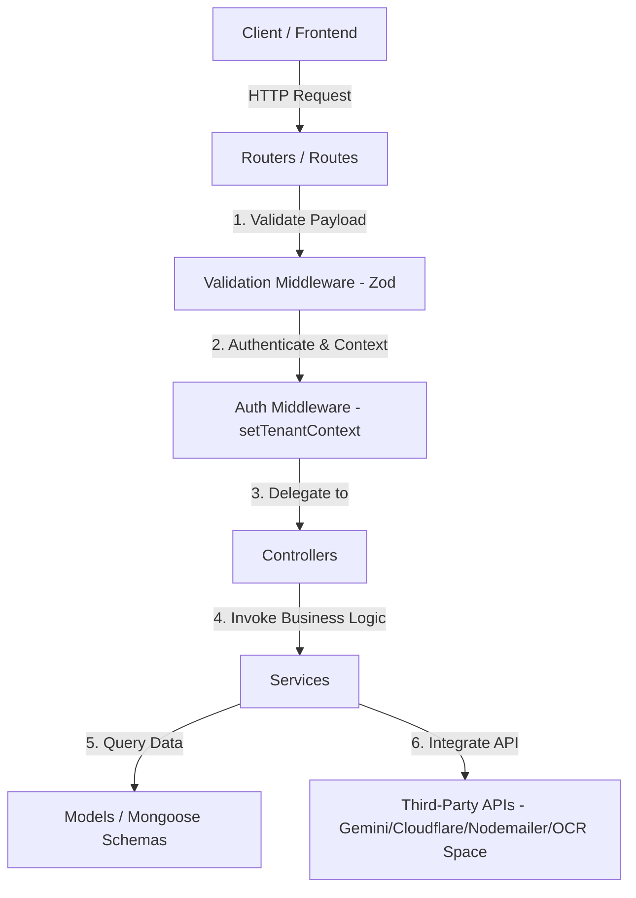

# 🖥️ Note Loom — Backend Server API

The backend for the **Note Loom** multi-tenant college management platform. It provides a RESTful API built on **Node.js, Express, and MongoDB (Mongoose)**, powered by Google Gemini and Cloudflare AI services.

The codebase implements a clean **MVC / Clean Layered Architecture** model, separating HTTP routing from core controller logic, data schemas, and third-party integrations.

---

## 🏗️ Architectural Model (Clean Layered Architecture)

The backend separates concerns across distinct layers to support easy maintenance, scalability, and stateless deployments:



*   **Routers (`/routes`):** Lightweight route-mapping definitions mapping endpoints and applying validation/auth middleware.
*   **Validation Middleware (`/middleware/validateMiddleware.js`):** Enforces request schemas (using Zod) and blocks malformed input payloads with structured `400 Bad Request` messages before routing to controllers.
*   **Controllers (`/controllers`):** Execute controller logic, process request parameters, calculate outputs, and formulate HTTP responses.
*   **Services (`/services`):** Pure Javascript utilities managing business transactions, file parsing, and external API requests (Gemini, Cloudflare AI, Cloud OCR Space).
*   **Models (`/models`):** Mongoose schemas defining database structures.

---

## 📁 Directory Structure

```
noteloom-backend/
├── server.js               # Entry point (bootstraps database & HTTP server)
├── vercel.json             # Serverless Vercel config
├── Dockerfile              # Hugging Face Spaces production container config
├── .gitignore              # Excludes environment configurations and build caches
├── refactoring-summary.txt # Detailed developer refactoring summary log
│
├── 📁 config/              # Central configurations
│   ├── db.js               # MongoDB database connection caching (Serverless friendly)
│   ├── cloudinary.js       # Cloudinary SDK config & Multer storage configuration
│   └── masterFeatures.js   # Master features definition
│
├── 📁 middleware/          # Express route middlewares
│   ├── authMiddleware.js   # JWT authentication & multi-tenant context injector
│   └── validateMiddleware.js# Zod-based request schema validation middleware
│
├── 📁 routes/              # Thin routers mapping paths to controllers
│   ├── authRoutes.js
│   ├── aiRoutes.js
│   ├── coeRoutes.js
│   ├── leaveRoutes.js
│   ├── attendanceRoutes.js
│   ├── libraryRoutes.js
│   └── lmsRoutes.js
│
├── 📁 controllers/         # Extracted controller handlers (Business Logic)
│   ├── authController.js
│   ├── aiController.js
│   ├── coeController.js
│   ├── leaveController.js
│   ├── libraryController.js
│   ├── attendanceController.js
│   ├── lmsController.js
│   └── academicController.js# Unified controller for batches, classrooms, and depts
│
├── 📁 services/            # Third-party integrations
│   ├── emailService.js     # Nodemailer SMTP and overdue loan alert dispatcher
│   ├── ocrService.js       # Local Tesseract OCR processing
│   ├── fileParserService.js# File parsers with Cloud OCR Space PDF fallback
│   ├── geminiService.js    # Gemini SDK File API & text generation
│   └── cloudflareService.js# Cloudflare Llama/Whisper fallbacks
│
├── 📁 models/              # Mongoose/MongoDB data collections
│   ├── User.js
│   ├── Tenant.js
│   ├── Library.js          # Encrypted credentials (AES-256-GCM) & book inventory
│   ├── AttendanceModels.js # Standard records & WeeklyReport schema
│   └── ...
│
├── 📁 templates/           # HTML layout templates
│   └── emailTemplates.js   # Verification OTP and Library overdue warning alerts
│
└── 📁 scripts/             # Testing operations
    └── runTests.js         # Integration test suite (40 tests passing)
```

---

## 🛠️ Tech Stack & Key Integrations
*   **Core:** Node.js, Express, Mongoose, Zod (Validation), JWT, bcryptjs
*   **Cryptography:** AES-256-GCM (encryptions for database library portal credentials)
*   **File Parsing:** Mammoth (.docx), ExcelJS (.xlsx), Officeparser (.pptx), pdf-parse (.pdf), sharp (image scaling), fluent-ffmpeg
*   **AI Models:** Google Gemini 2.5 Flash Lite with Cloudflare Workers AI fallback (Llama 3, Whisper audio-to-text)
*   **OCR Engines:** Tesseract.js (local image parsing) & Cloud OCR Space API (lightweight scanned PDF translation)
*   **Storage:** Multer + Cloudinary (auto-cleaned on database deletion)
*   **Email:** Nodemailer (SMTP transport for OTP verification and overdue circulation warnings)

---

## 🚀 Running Locally

### 1. Prerequisites
Ensure Node.js 18+ and a running MongoDB instance are installed.

### 2. Environment Variables (.env)
Create a `.env` file in the backend root based on `.env.example`:
```env
PORT=4000
MONGO_URI=mongodb+srv://...
JWT_SECRET=your_jwt_secret
CRON_SECRET=your_cron_verification_secret
ENCRYPTION_KEY=32_byte_hex_encryption_key

# AI Configurations
GEMINI_API_KEY=your_gemini_key
CLOUDFLARE_ACCOUNT_ID=your_cloudflare_id
CLOUDFLARE_API_TOKEN=your_cloudflare_token
OCR_SPACE_API_KEY=your_optional_ocr_space_key

# Cloudinary
CLOUDINARY_CLOUD_NAME=your_name
CLOUDINARY_API_KEY=your_key
CLOUDINARY_API_SECRET=your_secret

# Email Configurations
EMAIL_USER=your_gmail_or_smtp_address
EMAIL_PASS=your_gmail_app_password
```

### 3. Start Server
Install dependencies and run:
```bash
npm install
npm run dev
```
The server will start listening at `http://localhost:4000`.

---

## 🐳 Deploying to Hugging Face Spaces (Docker Space)

Hugging Face Spaces runs persistently inside containers. Since Node.js is not a native template, you must configure a **Docker Space**.

1. Create a new Space on Hugging Face and choose **Docker** as the SDK.
2. The repository is pre-configured with a production-ready `Dockerfile` that:
   * Installs production dependencies via `npm ci`.
   * Binds to the required default port `7860`.
   * Runs under a non-root user (UID `1000`) to conform to Hugging Face's security model.
3. Configure your environment secrets in the Hugging Face Space settings console matching the variables in your `.env`.

---

## 🧪 Testing

The backend includes a comprehensive integration test suite.
To execute:
```bash
node scripts/runTests.js
```
All **40** test cases (verifying auth, session validation, route guards, cron alerts, LMS modules, and Zod validator intercepts) will run and output results.

---

## ⏳ Remaining Tasks & Next Steps (Frontend Focus)

While the backend is fully refactored, secure, and complete, the following technical debt remains on the frontend:

1.  **Monolith Deconstruction:** Split the 8,200+ line monolith [src/App.jsx](file:///d:/NoteLoom/Code-files/noteloom-frontend/src/App.jsx) in the frontend project into modular pages (e.g. Auth, dashboards, timetables) and layouts.
2.  **Frontend Database Dependencies:** Remove `mongodb` from the frontend [package.json](file:///d:/NoteLoom/Code-files/noteloom-frontend/package.json) to stop backend drivers from bloating the browser build size.
3.  **Environment Variable API Base URL:** Transition hardcoded backend fetch base URLs in the frontend to use `import.meta.env.VITE_API_BASE_URL` instead of the hardcoded `https://noteloom-api.vercel.app` strings.
4.  **Payment Gateway Integration:** Evolve the examination checkout form payment status from a direct mocked `'Paid'` status updates into a sandbox integration stub (e.g. Stripe checkout page).